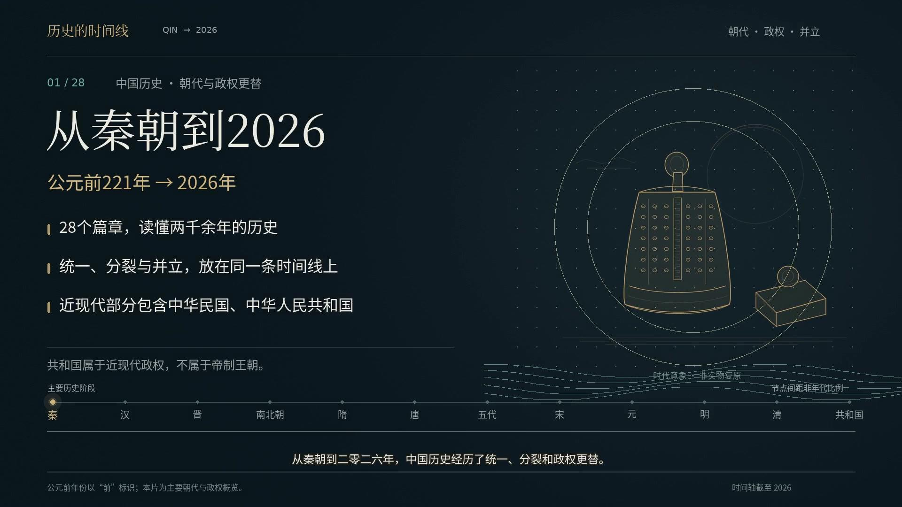

# 秦朝到2026年：朝代与政权变迁

约5分01秒的中文历史时间轴视频，1080P横屏，包含中文旁白、同步字幕和原创配乐。

内容覆盖秦汉、魏晋、南北朝、隋唐、五代十国、宋辽金夏、元明清，以及中华民国、中华人民共和国。1949年后的相关时间线分别标注，2026年为展示截止点。

## 下载

- [下载视频（MP4）](https://raw.githubusercontent.com/JinGaoX/chatgpt-cloud/main/videos/qin-to-2026-1080p.mp4)
- [下载中文字幕（SRT）](https://raw.githubusercontent.com/JinGaoX/chatgpt-cloud/main/videos/qin-to-2026.zh-CN.srt)
- [查看仓库与附件](https://github.com/JinGaoX/chatgpt-cloud)

视频和字幕也保存在本仓库的 `videos/` 目录中。下载视频后可使用电脑或手机播放器打开；字幕已内嵌，单独SRT文件供编辑使用。

## 文件校验

`videos/SHA256SUMS.txt` 提供视频、字幕和封面的SHA-256校验值。
